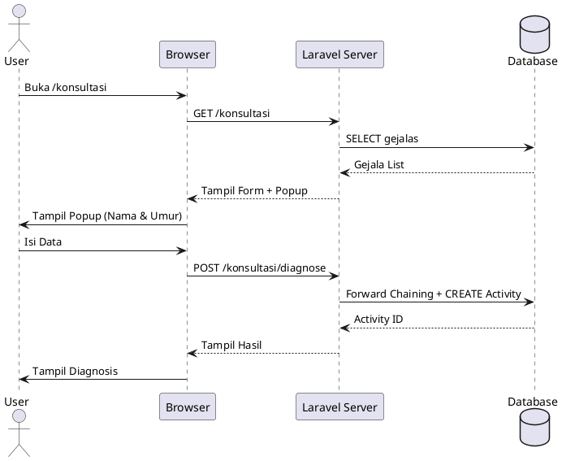
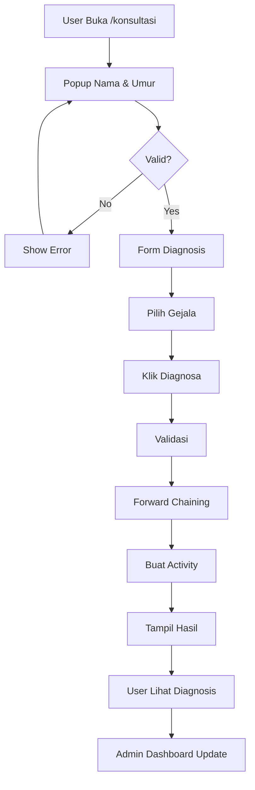

# Flowchart Sistem Pakar Diagnosis Diabetes

## 1. Flowchart Keseluruhan Sistem

```
┌─────────────────────────────────────────────────────────────────┐
│                    START - SISTEM PAKAR DIABETES                 │
└─────────────────────────────────────────────────────────────────┘
                              │
                              ▼
                    ┌──────────────────────┐
                    │   USER MENGAKSES     │
                    │   /konsultasi/       │
                    └──────────────────────┘
                              │
                              ▼
                    ┌──────────────────────────┐
                    │  POPUP: ISI NAMA & UMUR  │
                    │  - Nama Lengkap          │
                    │  - Umur (0-120 tahun)    │
                    └──────────────────────────┘
                              │
                    ┌─────────▼─────────┐
                    │  Data Valid?      │
                    └─────────┬─────────┘
                         NO  │  YES
                    ┌────────┴────────┐
                    │                 │
                    ▼                 ▼
            ┌─────────────┐    ┌──────────────────────┐
            │ Tampil Error│    │ SIMPAN DATA PRIBADI  │
            │ (kembali)   │    │ di Hidden Field      │
            └─────────────┘    └──────────────────────┘
                                      │
                                      ▼
                            ┌──────────────────────┐
                            │  FORM DIAGNOSIS      │
                            │  - Pilih Gejala      │
                            │  - Min 1 gejala      │
                            └──────────────────────┘
                                      │
                                      ▼
                            ┌──────────────────────┐
                            │  User Pilih Gejala   │
                            │  (Multiple Select)   │
                            └──────────────────────┘
                                      │
                                      ▼
                            ┌──────────────────────┐
                            │  Klik Tombol Diagnosa│
                            └──────────────────────┘
                                      │
                              ┌───────▼────────┐
                              │  Gejala Valid? │
                              └───────┬────────┘
                                 NO  │  YES
                        ┌───────────┴───────────┐
                        │                       │
                        ▼                       ▼
                ┌──────────────────┐   ┌─────────────────────────┐
                │ Tampil Error     │   │ POST ke /konsultasi/    │
                │ (minimal 1)      │   │ diagnose                │
                └──────────────────┘   └─────────────────────────┘
                                                │
                                                ▼
                                    ┌─────────────────────────────┐
                                    │ BACKEND: KonsultasiController│
                                    │ ::diagnose()                │
                                    └─────────────────────────────┘
                                                │
                                                ▼
                                    ┌─────────────────────────────┐
                                    │ VALIDASI SERVER-SIDE        │
                                    │ - user_name: required       │
                                    │ - user_age: required (0-120)│
                                    │ - gejala_ids: array, min 1  │
                                    └─────────────────────────────┘
                                                │
                                        ┌───────▼────────┐
                                        │  Valid?        │
                                        └───────┬────────┘
                                           NO  │  YES
                            ┌──────────────────┴──────────────────┐
                            │                                     │
                            ▼                                     ▼
                    ┌──────────────┐              ┌───────────────────────┐
                    │ Return Error │              │ JALANKAN FORWARD      │
                    │ Validation   │              │ CHAINING ALGORITHM    │
                    └──────────────┘              └───────────────────────┘
                                                           │
                                                           ▼
                                        ┌───────────────────────────────┐
                                        │ ALGORITMA FORWARD CHAINING    │
                                        │ 1. Load Semua Aturan + Detail │
                                        │ 2. For Each Aturan:           │
                                        │    - Hitung Gejala Cocok      │
                                        │    - If 100% Match → Catat    │
                                        │ 3. If Ada Match:              │
                                        │    → Hitung Rata2 Confidence  │
                                        │    → Sort by Confidence DESC  │
                                        │ 4. If Tidak Ada Match:        │
                                        │    → Cari Partial Match (%)   │
                                        │    → Return Top 2 Result      │
                                        └───────────────────────────────┘
                                                           │
                                                           ▼
                                        ┌───────────────────────────────┐
                                        │ BUAT ACTIVITY RECORD          │
                                        │ - user_name: Dari Form        │
                                        │ - user_age: Dari Form         │
                                        │ - diagnosis_data: JSON Array  │
                                        │ - selected_gejala: JSON Array │
                                        │ - result_summary: String      │
                                        │ - created_at: Timestamp       │
                                        └───────────────────────────────┘
                                                           │
                                                           ▼
                                        ┌───────────────────────────────┐
                                        │ SIMPAN KE DATABASE            │
                                        │ - Table: activities           │
                                        │ - Status: Saved ✓             │
                                        │ - Return activity_id          │
                                        └───────────────────────────────┘
                                                           │
                                                           ▼
                                        ┌───────────────────────────────┐
                                        │ FLASH: activity_id ke Session │
                                        │ Return View: konsultasi.result│
                                        └───────────────────────────────┘
                                                           │
                                                           ▼
                                        ┌───────────────────────────────┐
                                        │ HALAMAN HASIL DIAGNOSIS       │
                                        │ - Tampil Activity ID (debug)  │
                                        │ - List Hasil Diagnosis        │
                                        │ - Confidence % & Progress Bar │
                                        │ - Deskripsi Penyakit          │
                                        │ - Penanganan Rekomendasi      │
                                        │ - Aturan yang Cocok           │
                                        └───────────────────────────────┘
                                                           │
                                                           ▼
                                        ┌───────────────────────────────┐
                                        │ USER MELIHAT HASIL            │
                                        │ - Diagnosis: Penyakit A 85%   │
                                        │ - Diagnosis: Penyakit B 60%   │
                                        │ - Aksi: Diagnosis Ulang/Home  │
                                        └───────────────────────────────┘
                                                           │
                                                           ▼
                                        ┌───────────────────────────────┐
                                        │         END - USER            │
                                        └───────────────────────────────┘
```

---

## 2. Flowchart Admin Dashboard

```
┌────────────────────────────────────────┐
│  ADMIN LOGIN                           │
│  /admin/login                          │
└────────────────────────────────────────┘
              │
              ▼
    ┌─────────────────────────┐
    │  Masukkan Username &     │
    │  Password               │
    └─────────────────────────┘
              │
              ▼
    ┌─────────────────────────┐
    │  Valid Credentials?     │
    └─────────────────────────┘
       NO │        │ YES
        └─┼────────┘
          │
    ┌─────▼──────────────┐
    │ Show Error Message  │
    └─────────────────────┘
              │
              ▼
    ┌─────────────────────────────────┐
    │  ADMIN DASHBOARD                │
    │  Route: /admin/dashboard        │
    └─────────────────────────────────┘
              │
              ▼
    ┌─────────────────────────────────┐
    │  LOAD STATISTIK                 │
    │  - Total Gejala: COUNT(*)       │
    │  - Total Penyakit: COUNT(*)     │
    │  - Total Aturan: COUNT(*)       │
    │  - Latest Activities: LIMIT 10  │
    └─────────────────────────────────┘
              │
              ▼
    ┌─────────────────────────────────┐
    │  TAMPILKAN HALAMAN              │
    │  ┌──────────────────────────────┐
    │  │ MENU ADMIN:                  │
    │  │ - Dashboard (active)         │
    │  │ - Manajemen Gejala           │
    │  │ - Manajemen Penyakit         │
    │  │ - Manajemen Aturan           │
    │  └──────────────────────────────┘
    │  ┌──────────────────────────────┐
    │  │ STATISTIK:                   │
    │  │ - Total Gejala: [19]         │
    │  │ - Total Penyakit: [4]        │
    │  │ - Total Aturan: [12]         │
    │  └──────────────────────────────┘
    │  ┌──────────────────────────────┐
    │  │ AKTIVITAS TERBARU:           │
    │  │ ┌────────────────────────────┤
    │  │ │ User │ Umur │ Diagnosis  │
    │  │ │ Budi │  45  │ Diabetes T2│
    │  │ │ Siti │  38  │ Diabetes T1│
    │  │ └────────────────────────────┤
    │  └──────────────────────────────┘
    └─────────────────────────────────┘
              │
              ▼
    ┌─────────────────────────────────┐
    │  ADMIN ACTIONS                  │
    │  ├─ Kelola Gejala (CRUD)        │
    │  ├─ Kelola Penyakit (CRUD)      │
    │  ├─ Kelola Aturan (CRUD)        │
    │  └─ Lihat Aktivitas User        │
    └─────────────────────────────────┘
              │
              ▼
    ┌─────────────────────────────────┐
    │  PILIHAN:                       │
    │  1. Kelola Data Master          │
    │  2. Monitor Aktivitas           │
    │  3. Logout                      │
    └─────────────────────────────────┘
```

---

## 3. Flowchart Forward Chaining Algorithm

```
┌─────────────────────────────────────────┐
│  MULAI FORWARD CHAINING                 │
│  Input: selectedGejalaIds (Array)       │
└─────────────────────────────────────────┘
              │
              ▼
┌─────────────────────────────────────────┐
│  LOAD SEMUA ATURAN + DETAIL             │
│  SELECT * FROM aturans                  │
│  JOIN aturan_details ON ...             │
│  JOIN gejalas, penyakits                │
└─────────────────────────────────────────┘
              │
              ▼
┌─────────────────────────────────────────┐
│  INITIALIZE                             │
│  matchedDiseases = []                   │
│  Loop each aturan:                      │
└─────────────────────────────────────────┘
              │
              ▼
        ┌─────────────────┐
        │ Get Required    │
        │ Gejala IDs      │
        │ for Aturan      │
        └─────────────────┘
              │
              ▼
        ┌─────────────────────────────────┐
        │ Calculate Match Count:          │
        │ matchedCount = intersection(    │
        │   requiredGejalaIds,            │
        │   selectedGejalaIds             │
        │ )                               │
        └─────────────────────────────────┘
              │
              ▼
        ┌──────────────────────┐
        │ Check if 100% Match: │
        │ matchedCount ==      │
        │ totalRequired?       │
        └──────────────────────┘
             NO │ YES
        ┌───────┴─────────┐
        │                 │
        ▼                 ▼
    [Continue]     ┌─────────────────────┐
                   │ Is Disease Exists   │
                   │ in matchedDiseases? │
                   └─────────────────────┘
                        NO │ YES
                   ┌────────┴──────────┐
                   │                   │
                   ▼                   ▼
            ┌──────────────┐   ┌──────────────────┐
            │ Add New:     │   │ Update Existing: │
            │ penyakitId→  │   │ - Increment Count│
            │ confidence   │   │ - Add Confidence│
            │ aturans[]    │   │ - Add Aturan    │
            └──────────────┘   └──────────────────┘
                   │                   │
                   └─────────┬─────────┘
                             │
                             ▼
                    ┌──────────────────────┐
                    │ Continue Loop?       │
                    │ (More Aturans)       │
                    └──────────────────────┘
                         YES │ NO
                    ┌────────┴──────────┐
                    │                   │
                    ▼                   ▼
                [Loop]            ┌─────────────────┐
                                  │ Check if Empty? │
                                  │ matchedDiseases │
                                  └─────────────────┘
                                    YES │  NO
                        ┌───────────────┴──────────────┐
                        │                              │
                        ▼                              ▼
                ┌─────────────────┐       ┌────────────────────────┐
                │ Call handleNo    │       │ Calculate Avg          │
                │ Match()          │       │ Confidence for each    │
                │ → Partial Match  │       │ penyakit:              │
                │ → Top 2 Results  │       │ confidence /= aturan   │
                │                  │       │ _count                 │
                └─────────────────┘       └────────────────────────┘
                        │                              │
                        │                              ▼
                        │                   ┌────────────────────────┐
                        │                   │ Sort by Confidence DESC│
                        │                   │ usort(matchedDiseases) │
                        │                   └────────────────────────┘
                        │                              │
                        └──────────────┬───────────────┘
                                       │
                                       ▼
                        ┌──────────────────────────────┐
                        │ RETURN DIAGNOSIS RESULTS     │
                        │ - Penyakit A: 85% confidence │
                        │ - Penyakit B: 72% confidence │
                        │ - etc                        │
                        └──────────────────────────────┘
                                       │
                                       ▼
                        ┌──────────────────────────────┐
                        │ END FORWARD CHAINING         │
                        └──────────────────────────────┘
```

---

## 4. Flowchart Data Activity Logging

```
┌────────────────────────────────────────┐
│  USER SELESAI DIAGNOSIS                │
│  (Diagnosis Results Ready)             │
└────────────────────────────────────────┘
              │
              ▼
┌────────────────────────────────────────┐
│  TRY: CREATE ACTIVITY RECORD           │
└────────────────────────────────────────┘
              │
              ▼
┌────────────────────────────────────────┐
│  NORMALIZE DIAGNOSIS DATA              │
│  - Convert Eloquent Models to Arrays   │
│  - Handle Non-Serializable Data        │
│  - Prepare JSON-Safe Payload           │
└────────────────────────────────────────┘
              │
              ▼
┌────────────────────────────────────────┐
│  ACTIVITY::CREATE([                    │
│    'user_id' → User ID or NULL         │
│    'user_name' → Form Input            │
│    'user_age' → Form Input             │
│    'action' → 'diagnosis'              │
│    'result_summary' → Top Result       │
│    'diagnosis_data' → JSON Array       │
│    'selected_gejala' → JSON Array      │
│    'created_at' → NOW()                │
│  ])                                    │
└────────────────────────────────────────┘
              │
              ▼
┌────────────────────────────────────────┐
│  INSERT INTO activities (...)          │
│  VALUES (...)                          │
└────────────────────────────────────────┘
              │
              ▼
        ┌─────────────────┐
        │ Success?        │
        └─────────────────┘
         YES │      │ NO
    ┌────────┴──────────────┐
    │                       │
    ▼                       ▼
┌──────────────────┐  ┌──────────────────────────┐
│ GET Activity ID  │  │ CATCH Exception          │
│ Save to Session: │  │ Log Error:               │
│ activity_id=ID   │  │ \Log::error(message)     │
│ Flash Message    │  │ Don't Block User Flow    │
│                  │  │ Return Result Anyway     │
└──────────────────┘  └──────────────────────────┘
    │                       │
    └────────────┬──────────┘
                 │
                 ▼
    ┌────────────────────────────┐
    │ RETURN RESULT VIEW         │
    │ - Show Activity ID (if OK) │
    │ - Show Diagnosis Results   │
    │ - User Action Options      │
    └────────────────────────────┘
```

---

## 5. Flowchart Manajemen Data Master (CRUD)

```
┌───────────────────────────────┐
│ ADMIN PILIH MENU              │
│ - Manajemen Gejala            │
│ - Manajemen Penyakit          │
│ - Manajemen Aturan            │
└───────────────────────────────┘
         │
         ▼
    ┌─────────────────┐
    │ INDEX VIEW      │
    │ GET /admin/     │
    │ [resource]      │
    └─────────────────┘
         │
         ▼
    ┌────────────────────────┐
    │ LOAD DATA FROM DB      │
    │ SELECT * FROM [table]  │
    └────────────────────────┘
         │
         ▼
    ┌────────────────────────┐
    │ DISPLAY DATA TABLE     │
    │ ┌──────────────────────┤
    │ │ Name│Code│Desc│Action
    │ │─────┼────┼────┼────── │
    │ │ Item│ C01│Desc│E│D    │
    │ └──────────────────────┘
    └────────────────────────┘
         │
         ▼
    ┌────────────────────────┐
    │ ADMIN ACTIONS          │
    │ - CREATE (Tambah)      │
    │ - READ (Lihat Detail)  │
    │ - UPDATE (Edit)        │
    │ - DELETE (Hapus)       │
    └────────────────────────┘
         │
    ┌────┼─────┬──────┬──────┐
    │    │     │      │      │
    ▼    ▼     ▼      ▼      ▼
   [+]  [V]   [✎]   [🗑]   [<]
    │    │     │      │      │
    ▼    ▼     ▼      ▼      ▼
   C    R     U      D      Back
    │    │     │      │      │
    ▼    ▼     ▼      ▼      ▼
   CREATE  READ  UPDATE DELETE
```

---

## 6. Database Tables & Relationships

```
┌─────────────────────┐
│      USERS          │
├─────────────────────┤
│ id (PK)             │
│ name                │
│ email               │
│ password            │
│ created_at          │
└─────────────────────┘
         │
         │ 1:N (user_id)
         │
┌─────────────────────────────┐
│      ACTIVITIES             │
├─────────────────────────────┤
│ id (PK)                     │
│ user_id (FK → users)        │
│ user_name                   │
│ user_age                    │
│ action (diagnosis)          │
│ result_summary              │
│ diagnosis_data (JSON)       │
│ selected_gejala (JSON)      │
│ created_at                  │
└─────────────────────────────┘


┌──────────────────┐
│     GEJALAS      │
├──────────────────┤
│ id (PK)          │
│ kode_gejala      │
│ nama_gejala      │
│ deskripsi        │
│ created_at       │
└──────────────────┘
         │
         │ N:M (via aturan_details)
         │
┌──────────────────────┐
│   ATURAN_DETAILS     │
├──────────────────────┤
│ id (PK)              │
│ aturan_id (FK)      │
│ gejala_id (FK)      │
│ created_at           │
└──────────────────────┘
         │
         │ N:1
         │
┌──────────────────────┐
│      ATURANS         │
├──────────────────────┤
│ id (PK)              │
│ nama_aturan          │
│ penyakit_id (FK)     │
│ confidence           │
│ created_at           │
└──────────────────────┘
         │
         │ N:1
         │
┌──────────────────┐
│    PENYAKITS     │
├──────────────────┤
│ id (PK)          │
│ kode_penyakit    │
│ nama_penyakit    │
│ deskripsi        │
│ penanganan       │
│ created_at       │
└──────────────────┘
```

---

## 7. Flow User Diagnosis Summary

```
START
  ↓
[Buka /konsultasi]
  ↓
[POPUP: Isi Nama & Umur]
  ↓
[Validasi? NO → Error, YES → Continue]
  ↓
[Lihat Form Diagnosis dengan Gejala]
  ↓
[Pilih Minimal 1 Gejala (Multiple)]
  ↓
[Klik Tombol "Diagnosa"]
  ↓
[SUBMIT ke /konsultasi/diagnose]
  ↓
[BACKEND: Validasi & Forward Chaining]
  ↓
[Hasil: Diagnosis Penyakit + Confidence]
  ↓
[SIMPAN ke activities table]
  ↓
[SHOW Hasil Diagnosis dengan Activity ID]
  ↓
[User Bisa: Diagnosa Ulang / Kembali Home]
  ↓
[ADMIN DASHBOARD: Lihat Activity Terbaru]
  ↓
END
```

---

## Instruksi Membuat Diagram Lebih Detail

Untuk membuat flowchart yang lebih profesional, Anda dapat menggunakan tools:

### 1. **Lucidchart** (Online, Web-Based)
- URL: https://www.lucidchart.com
- Kelebihan: Kolaboratif, Export ke berbagai format
- Buat diagram dari scratch atau import dari file

### 2. **Draw.io** (Online & Desktop)
- URL: https://draw.io
- Kelebihan: Gratis, offline support, banyak template
- Export: PNG, SVG, PDF, XML

### 3. **PlantUML** (Text-Based, Code)
- Gunakan syntax khusus untuk generate diagram
- Bisa diintegrasikan ke dalam repository

**Contoh PlantUML:**


### 4. **Mermaid** (GitHub Native)
Bisa langsung digunakan di markdown:



### 5. **Microsoft Visio** / **Draw.io Desktop**
- Untuk diagram offline dan file sharing
- Format: .vsdx, .xml, .drawio

---

## File Struktur Diagram dalam Project

Saran saya:
```
diabetes-expert-system/
├── docs/
│   ├── FLOWCHART.md          ← File ini
│   ├── flowchart-diagnosis.png
│   ├── flowchart-admin.png
│   ├── flowchart-algorithm.png
│   ├── ERD.png               (Entity Relationship Diagram)
│   └── SYSTEM_ARCHITECTURE.md
├── README.md
└── ...
```

---

## Quick Reference - Komponen Utama

| Komponen | File | Fungsi |
|----------|------|--------|
| **Frontend Form** | `resources/views/konsultasi/index.blade.php` | UI diagnosis + popup nama/umur |
| **Backend Logic** | `app/Http/Controllers/KonsultasiController.php` | Forward chaining + Activity logging |
| **Algorithm** | `KonsultasiController::forwardChaining()` | Inference engine |
| **Data Logging** | `app/Models/Activity.php` | Activity record model |
| **Admin View** | `resources/views/admin/dashboard.blade.php` | Tampil aktivitas user |
| **Database** | `database/migrations/` | Semua table schema |

---

Apakah Anda ingin saya membuat diagram dalam format Mermaid atau PlantUML yang bisa langsung ditampilkan dalam markdown?
