# Flowchart Sistem Diagnosis Diabetes - Menggunakan Mermaid

## Apa itu Mermaid?

Mermaid adalah tool untuk membuat diagram dari syntax/text. Diagram akan otomatis ter-render di:
- ✅ GitHub (README.md, Issues, Discussions)
- ✅ GitLab
- ✅ Notion
- ✅ Obsidian
- ✅ VS Code (dengan extension)
- ✅ Documentation tools (Docusaurus, MkDocs, etc)

---

## 1. Flowchart Diagnosis (Simple)

```mermaid
graph TD
    A["👤 User Buka /konsultasi"] --> B["📝 Popup: Isi Nama & Umur"]
    B --> C{"✅ Data Valid?"}
    C -->|❌ Tidak| D["⚠️ Tampil Error"]
    D --> B
    C -->|✅ Ya| E["📋 Form Diagnosis Muncul"]
    E --> F["☑️ Pilih Minimal 1 Gejala"]
    F --> G{"✅ Gejala Dipilih?"}
    G -->|❌ Tidak| H["⚠️ Alert: Pilih Gejala"]
    H --> F
    G -->|✅ Ya| I["🔘 Klik Tombol DIAGNOSA"]
    I --> J["📤 POST ke Backend"]
    J --> K["⚙️ Forward Chaining Algorithm"]
    K --> L["💾 Simpan ke Database"]
    L --> M["📊 Tampil Hasil Diagnosis"]
    M --> N["👁️ User Lihat Hasil"]
    N --> O{"Tindakan User?"}
    O -->|Diagnosa Ulang| E
    O -->|Kembali Home| P["🏠 Home Page"]
    O -->|Lihat Dashboard| Q["📈 Admin Dashboard"]
```



---

## 2. Flowchart Lengkap dengan Kondisi

```mermaid
graph TD
    START["🟢 START"] --> KONSULTASI["Akses /konsultasi"]
    KONSULTASI --> MODAL["Popup Nama & Umur Muncul"]
    MODAL --> VALIDASI1{"Nama & Umur<br/>Valid?"}
    
    VALIDASI1 -->|Tidak Valid| ERROR1["Tampil Pesan Error"]
    ERROR1 --> MODAL
    
    VALIDASI1 -->|Valid| STORE["Simpan di Hidden Field"]
    STORE --> FORM["Tampil Form Diagnosis"]
    
    FORM --> SELECT["User Pilih Gejala"]
    SELECT --> VALIDASI2{"Minimal<br/>1 Gejala?"}
    
    VALIDASI2 -->|Tidak| ALERT["Alert: Pilih Gejala"]
    ALERT --> SELECT
    
    VALIDASI2 -->|Ya| SUBMIT["POST /konsultasi/diagnose"]
    SUBMIT --> BACKEND["Backend Processing"]
    
    BACKEND --> VALIDATE_SERVER{"Validasi Server<br/>user_name, user_age,<br/>gejala_ids"}
    VALIDATE_SERVER -->|Error| ERROR2["Return Validation Error"]
    ERROR2 --> FORM
    
    VALIDATE_SERVER -->|Valid| ALGO["Jalankan Forward<br/>Chaining Algorithm"]
    ALGO --> MATCH["Cari Match Gejala<br/>dengan Aturan"]
    MATCH --> CALC["Hitung Confidence<br/>Setiap Penyakit"]
    CALC --> SORT["Sort by Confidence<br/>Descending"]
    
    SORT --> SAVE["Buat Activity Record"]
    SAVE --> INSERT["INSERT ke Database<br/>activities table"]
    INSERT --> FLASH["Flash activity_id<br/>ke Session"]
    
    FLASH --> RESULT["Return Result View"]
    RESULT --> SHOW["Tampil Diagnosis:"]
    SHOW --> SHOW1["- Activity ID<br/>- List Penyakit<br/>- Confidence %<br/>- Rekomendasi"]
    
    SHOW1 --> ACTION{"User Action?"}
    ACTION -->|Ulang| SELECT
    ACTION -->|Home| HOME["🏠 Kembali Home"]
    ACTION -->|Admin| ADMIN["👨‍💼 Admin Dashboard"]
    
    HOME --> END1["🔴 END"]
    ADMIN --> END2["🔴 END"]
```



---

## 3. Flowchart Admin Dashboard

```mermaid
graph LR
    A["👤 Admin"] --> B["Login /admin/login"]
    B --> C{"Credentials<br/>Valid?"}
    C -->|❌ Tidak| D["❌ Login Failed"]
    D --> B
    C -->|✅ Ya| E["✅ Redirect Dashboard"]
    E --> F["📊 Admin Dashboard"]
    
    F --> G["📈 Statistik"]
    F --> H["📋 Menu Management"]
    F --> I["👥 Recent Activities"]
    
    G --> G1["Total Gejala: 19"]
    G --> G2["Total Penyakit: 4"]
    G --> G3["Total Aturan: 12"]
    
    H --> H1["➕ Tambah Gejala"]
    H --> H2["➕ Tambah Penyakit"]
    H --> H3["➕ Tambah Aturan"]
    
    I --> I1["👤 Budi - Diabetes Type 2"]
    I --> I2["👤 Siti - Diabetes Type 1"]
    I --> I3["👤 Ahmad - Prediabetes"]
```



---

## 4. Flowchart Database Activity Logging

```mermaid
graph TD
    DIAGNOSIS["Diagnosis Selesai"] --> NORMALIZE["Normalize Data:<br/>- Convert Model → Array<br/>- Make JSON-Safe"]
    NORMALIZE --> PREPARE["Prepare Activity Data:<br/>- user_id<br/>- user_name<br/>- user_age<br/>- action: diagnosis<br/>- diagnosis_data (JSON)<br/>- selected_gejala (JSON)<br/>- result_summary"]
    
    PREPARE --> TRY["TRY {"]
    TRY --> CREATE["Activity::create()"]
    CREATE --> INSERT["INSERT INTO activities"]
    INSERT --> SUCCESS{"Success?"}
    
    SUCCESS -->|✅ Ya| GETID["Get Activity ID"]
    GETID --> FLASH["Flash to Session"]
    FLASH --> LOG["Log: Activity created ID #"]
    LOG --> RETURN["Return Result View"]
    
    SUCCESS -->|❌ Tidak| CATCH["CATCH Exception"]
    CATCH --> LOGERROR["Log Error Message"]
    LOGERROR --> DONTBLOCK["Don't Block User"]
    DONTBLOCK --> RETURN
```



---

## 5. Flowchart Forward Chaining Algorithm


---

## 6. Flowchart CRUD Management

```mermaid
graph TD
    ADMIN["👨‍💼 Admin"] --> MENU["Pilih Menu:<br/>Gejala/Penyakit/Aturan"]
    MENU --> INDEX["GET /admin/[resource]"]
    INDEX --> LOAD["Load Data dari DB"]
    LOAD --> VIEW["Tampil Table"]
    
    VIEW --> ACTION{"Action?"}
    
    ACTION -->|Tambah| CREATE["GET /admin/[resource]/create"]
    CREATE --> FORM_CREATE["Form Create"]
    FORM_CREATE --> SUBMIT_CREATE["POST /admin/[resource]"]
    SUBMIT_CREATE --> INSERT["INSERT ke DB"]
    INSERT --> REDIRECT1["Redirect ke INDEX"]
    
    ACTION -->|Edit| EDIT["GET /admin/[resource]/{id}/edit"]
    EDIT --> FORM_EDIT["Form Edit + Data"]
    FORM_EDIT --> SUBMIT_EDIT["PUT /admin/[resource]/{id}"]
    SUBMIT_EDIT --> UPDATE["UPDATE DB"]
    UPDATE --> REDIRECT2["Redirect ke INDEX"]
    
    ACTION -->|Lihat| SHOW["GET /admin/[resource]/{id}"]
    SHOW --> DETAIL["Tampil Detail"]
    DETAIL --> REDIRECT3["Back ke INDEX"]
    
    ACTION -->|Hapus| DELETE["DELETE /admin/[resource]/{id}"]
    DELETE --> CONFIRM{"Confirm<br/>Delete?"}
    CONFIRM -->|Ya| DESTROY["DELETE dari DB"]
    CONFIRM -->|Tidak| CANCEL["Cancel"]
    DESTROY --> REDIRECT4["Redirect ke INDEX"]
    CANCEL --> REDIRECT5["Redirect ke INDEX"]
    
    REDIRECT1 --> VIEW
    REDIRECT2 --> VIEW
    REDIRECT3 --> VIEW
    REDIRECT4 --> VIEW
    REDIRECT5 --> VIEW
```



---

## 7. Sequence Diagram - User Flow

```mermaid
sequenceDiagram
    participant User as 👤 User
    participant Browser as 🌐 Browser
    participant Server as 🖥️ Server
    participant DB as 💾 Database

    User->>Browser: Buka /konsultasi
    Browser->>Server: GET /konsultasi
    Server->>DB: SELECT gejalas
    DB-->>Server: Gejala List
    Server-->>Browser: HTML Form + Popup
    Browser-->>User: Tampil Popup Nama & Umur

    User->>Browser: Isi Nama & Umur
    User->>Browser: Klik Lanjutkan
    Browser->>Browser: Validasi Client-Side
    Browser-->>User: Form Diagnosis Muncul

    User->>Browser: Pilih Gejala (Multiple)
    User->>Browser: Klik Tombol DIAGNOSA
    Browser->>Server: POST /konsultasi/diagnose
    
    Server->>Server: Validasi Data
    Server->>Server: Forward Chaining
    Server->>DB: SELECT aturans
    DB-->>Server: Aturan Data
    Server->>Server: Match & Calculate
    
    Server->>DB: INSERT INTO activities
    DB-->>Server: Activity ID
    Server-->>Browser: Result View + activity_id
    Browser-->>User: Tampil Hasil Diagnosis

    User->>Browser: Klik Diagnosa Ulang
    Browser->>Server: GET /konsultasi
    Server-->>Browser: Form Diagnosis Baru
    Browser-->>User: Form Siap Diisi
```



---

## 8. Entity Relationship Diagram (ERD)


---

## 9. State Diagram - Activity Status


---

## 10. Class Diagram - Models


---

## Cara Menggunakan Mermaid

### 1. **Di GitHub (README.md atau File Markdown)**

Syntax:
```markdown

```

Mermaid akan otomatis render sebagai diagram visual di GitHub.

---

### 2. **Di VS Code**

**Install Extension:**
- Buka VS Code Extensions
- Cari: `Markdown Preview Mermaid Support`
- Klik Install

**Gunakan:**
- Buka file `.md`
- Tulis kode mermaid
- Tekan `Ctrl+Shift+V` untuk preview

---

### 3. **Di Obsidian (Markdown App)**

- Install plugin `Mermaid`
- Buat code block dengan ` ```mermaid `
- Otomatis ter-render saat Anda view

---

### 4. **Di Notion**

- Salin kode mermaid dari editor online
- Paste ke Notion sebagai "Embed"
- Atau gunakan extension Notion

---

### 5. **Online Editor (Live Preview)**

**Mermaid Live Editor:**
- URL: https://mermaid.live
- Paste kode → Auto-render
- Export ke PNG, SVG, PDF

**Steps:**
1. Buka https://mermaid.live
2. Hapus contoh diagram
3. Paste salah satu diagram di atas
4. Lihat preview real-time
5. Klik tombol "Download" untuk export

---

### 6. **Di GitHub Actions / Documentation**

```yaml
# .github/workflows/docs.yml
name: Generate Diagrams
on: [push]

jobs:
  mermaid:
    runs-on: ubuntu-latest
    steps:
      - uses: actions/checkout@v2
      - name: Generate diagrams
        uses: dreampipe/github-action-mermaid@v1
        with:
          files: docs
          output: docs/generated
```

---

## Tipe-Tipe Diagram Mermaid

| Tipe | Gunakan Untuk |
|------|---------------|
| **graph/flowchart** | Alur proses, flow logic |
| **sequenceDiagram** | Interaksi antar komponen |
| **classDiagram** | Class & OOP relationships |
| **stateDiagram** | State machine, status flow |
| **erDiagram** | Database entity & relationships |
| **gantt** | Project timeline, scheduling |
| **pie** | Statistik pie chart |
| **bar** | Bar chart data |

---

## Contoh Praktis - Copy Paste ke File

**File: `diagrams.md`**

````markdown
# Diagram Sistem Diagnosis Diabetes

## User Flow Diagram

```mermaid
graph TD
    A["👤 User Buka /konsultasi"] --> B["📝 Popup Nama & Umur"]
    B --> C{"Data Valid?"}
    C -->|Ya| D["📋 Form Diagnosis"]
    C -->|Tidak| E["⚠️ Error"]
    E --> B
    D --> F["☑️ Pilih Gejala"]
    F --> G["🔘 Diagnosa"]
    G --> H["📊 Hasil"]
```



## Database Relationship


## Admin Sequence


````

---

## Tips & Tricks

### 1. **Styling & Colors**


### 2. **Icons & Emoji**

```mermaid
graph TD
    A["🟢 START"] --> B["📝 Input"]
    B --> C{"✅ Valid?"}
    C -->|Yes| D["💾 Save"]
    C -->|No| E["❌ Error"]
```



### 3. **Subgraph (Group Diagram)**


---

## Export Diagram

**Dari Mermaid Live Editor:**
1. Buka https://mermaid.live
2. Paste kode diagram
3. Klik menu ⋮ (three dots)
4. Pilih:
   - **Download SVG** → Untuk web
   - **Download PNG** → Untuk document
   - **Download PDF** → Untuk presentation

---

## Dokumentasi & Resources

- **Official:** https://mermaid.js.org
- **Syntax Guide:** https://mermaid.js.org/syntax/flowchart.html
- **Examples:** https://mermaid.live/edit
- **Cheat Sheet:** https://cheatography.com/syknapse/cheatsheets/mermaid-js-cheatsheet/

---

## Rekomendasi Workflow

1. **Buat diagram di Mermaid Live Editor** (https://mermaid.live)
   - Copy-paste kode dari file ini
   - Klik tombol untuk preview
   - Edit sesuai kebutuhan
   - Export ke PNG/SVG

2. **Atau langsung di GitHub**
   - Buat file `DIAGRAM.md`
   - Paste kode mermaid
   - Push ke repo
   - Diagram otomatis ter-render

3. **Best Practice**
   - Simpan semua diagram di folder `docs/diagrams/`
   - Setiap diagram di file `.md` terpisah
   - Reference dari `README.md`
   - Include di dokumentasi project

---

## Quick Copy-Paste Template

Gunakan template ini sebagai starting point untuk diagram baru:

```mermaid
graph TD
    START["🟢 START"] --> STEP1["Step 1"]
    STEP1 --> STEP2["Step 2"]
    STEP2 --> DECISION{"Decision?"}
    DECISION -->|Yes| STEP3["Step 3"]
    DECISION -->|No| STEP4["Step 4"]
    STEP3 --> END["🔴 END"]
    STEP4 --> END
```



---

Sudah siap gunakan Mermaid? 🎉

**Next Step:**
1. Kunjungi https://mermaid.live
2. Copy salah satu diagram di atas
3. Paste dan lihat hasilnya
4. Customize sesuai kebutuhan
5. Export & gunakan di dokumentasi project
